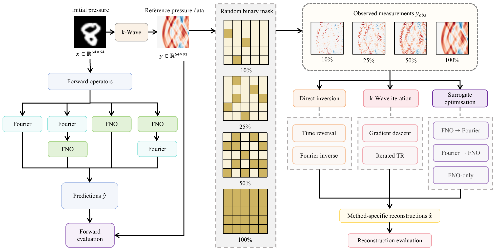
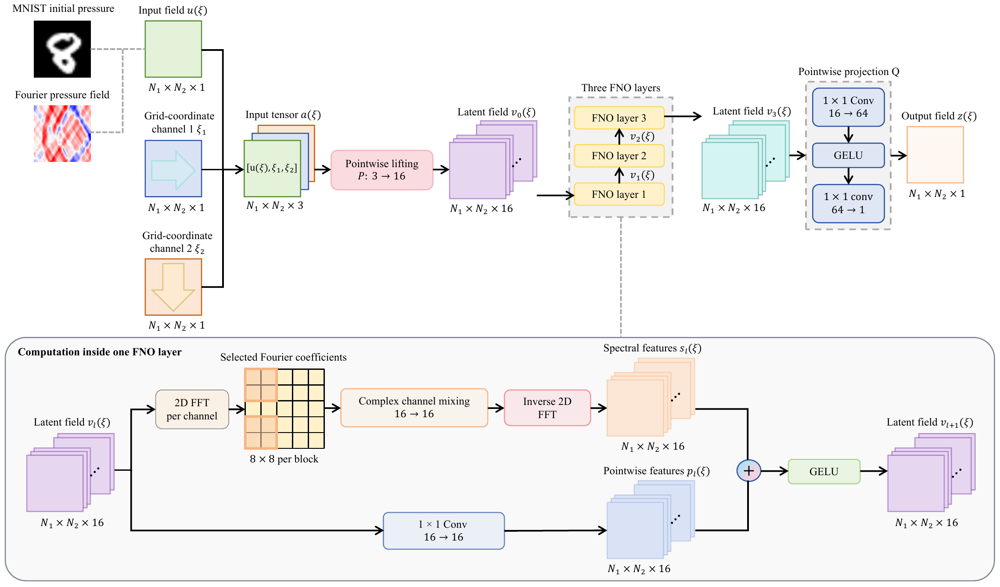

# Neural Operator Surrogates for Photoacoustic Tomography

**Fourier-Guided Approximation of k-Wave and Reconstruction from Incomplete Measurements**

This repository contains the Python implementation developed for an MSc dissertation in Scientific and Data Intensive Computing at University College London.

The project investigates whether Fourier neural operators can provide fast forward surrogates for photoacoustic tomography (PAT), and whether these surrogates remain reliable when used in reconstruction from incomplete measurements.

## Methods

The complete data-generation, forward-evaluation, and reconstruction workflow is summarised below.

*Overview of the data-generation, forward-evaluation, measurement-subsampling, and reconstruction workflow.*

k-Wave is used as the reference numerical forward model. Four alternative forward operators are evaluated:

- **Fourier:** a homogeneous-medium analytical approximation;
- **FNO-only:** an FNO that learns the complete map from initial pressure to detector-time pressure data;
- **Fourier-to-FNO:** an FNO that corrects an analytical Fourier prediction in measurement space;
- **FNO-to-Fourier:** an FNO that corrects the initial-pressure image before analytical Fourier propagation.

The shared FNO backbone, including coordinate augmentation, spectral layers, and pointwise projection, is shown below.

*Architecture of the shared FNO backbone and the computation performed within each spectral layer.*

The operators are evaluated under periodic 89-degree and PML 45-degree acquisition conditions. Their predictive accuracy, training-sample efficiency, and runtime are assessed using two-dimensional MNIST-derived initial-pressure images.

Reconstruction is evaluated after randomly retaining 10%, 25%, 50%, or 100% of the detector-time measurements. The reconstruction methods include:

- Fourier inversion;
- k-Wave time reversal;
- iterated time reversal;
- gradient descent using the discrete k-Wave adjoint;
- optimisation through FNO-only;
- optimisation through Fourier-to-FNO;
- optimisation through FNO-to-Fourier.

## Key findings

- On the principal large benchmark, Fourier-to-FNO achieved the lowest forward relative L2 errors: 0.2242 under periodic 89-degree acquisition and 0.2209 under PML 45-degree acquisition.
- Across five training-set sizes and three random seeds, Fourier-to-FNO reached a mean relative-L2 threshold of 0.22 using 10,000 training examples under both acquisition conditions.
- FNO-only first reached the same threshold using 50,000 examples, whereas FNO-to-Fourier did not reach it within the tested range.
- In hardware-controlled CPU measurements, the learned surrogates were approximately 11-19 times faster than k-Wave.
- Gradient descent produced the lowest reconstruction errors under severe measurement subsampling, while validation-selected iterated time reversal performed best at higher retention levels.
- The forward-error ranking did not transfer directly to learned reconstruction. Fourier-to-FNO was the most accurate forward surrogate, but it did not consistently produce the best learned reconstruction.

These findings support Fourier-to-FNO as a fast forward surrogate under the tested conditions, but not as a general replacement for k-Wave in inverse reconstruction.

## Experimental scope

The reported experiments use two-dimensional MNIST-derived initial-pressure images in a homogeneous acoustic medium without added measurement noise. The results evaluate controlled forward-model approximation and incomplete-data reconstruction rather than clinical PAT performance.

## Computational environments

Large-scale model training, sample-efficiency experiments, and GPU runtime measurements were performed on a remote NVIDIA GeForce RTX 4090 system. The recorded GPU runtime benchmarks used PyTorch 2.8.0 with CUDA 12.8.

The hardware-controlled CPU batch-one benchmark was performed separately with `--device cpu` in the local environment. That environment used PyTorch 2.11.0. Although the local computer contains an NVIDIA GeForce RTX 5060 Laptop GPU, that GPU was not used for the reported CPU measurements.

Computationally intensive reconstruction experiments were also run using the remote system. k-Wave propagation used its CPU backend, while CUDA was used for learned-operator optimisation where applicable.

The GPU surrogate speed-ups relative to CPU k-Wave include hardware and batching effects. They are therefore interpreted as system-level throughput measurements. The CPU batch-one benchmark provides the hardware-controlled comparison.

## Repository structure

    configs/              Experiment configurations
    src/pat_fno/          Reusable scientific Python package
    scripts/              Command-line experiment entry points
    tests/                Unit and integration tests
    examples/             Small reproducible examples
    results/              Curated summary tables and figures

## Experiment configurations

The versioned YAML files under `configs/` record the completed data-generation,
forward-training, sample-efficiency, reconstruction, and runtime protocols. They
separate the medium and large training schedules and retain the validation-selected
ITR step for every acquisition condition and retention level.

Configuration files can be validated without starting an experiment:

    python -c "from pat_fno.config import load_experiment_config; print(load_experiment_config('reconstruction/retention_study.yaml')['study'])"

## Installation

Using Conda:

    conda env create -f environment.yml
    conda activate pat_fno
    python -m pip install -e .

Alternatively, install the common dependencies with pip:

    python -m pip install -r requirements.txt
    python -m pip install -e .

To run the automated tests and code-quality checks, install the development
dependencies instead:

    python -m pip install -e ".[dev]"

For an RTX 4090/CUDA 12.8 environment matching the recorded GPU runtime configuration:

    python -m pip install -r requirements-gpu.txt
    python -m pip install -e . --no-deps

The project uses `k-wave-python==0.5.0rc1`, matching the version used for the reported experiments.

## Quick reproducibility example

The repository includes four fixed large-test inputs, their k-Wave targets, a
trained FNO-only checkpoint, 25% measurement masks, and expected metrics. The
complete example runs on CPU without downloading MNIST or regenerating k-Wave
data:

    python -m scripts.smoke.run_reproducibility_check \
      --config smoke/reproducibility.yaml

The command recomputes the analytical Fourier predictions, evaluates the supplied
FNO-only checkpoint, applies the saved masks, performs Fourier inverse
reconstruction, and compares all metrics with fixed expected results. A successful
run ends with `Overall reproducibility check: PASS` and writes
`results/smoke/summary.json`.

The same workflow is available as an opt-in integration test:

    python -m pytest tests/integration -m slow

## Testing and code quality

The fast unit suite checks numerical operators, configuration validation, data
handling, training, reconstruction, and evaluation utilities:

    python -m pytest tests/unit -q

The fixed end-to-end example is exercised separately because it loads the
included checkpoint and sample archive:

    python -m pytest tests/integration -m slow

Formatting and static checks are run with Ruff:

    ruff format --check .
    ruff check .

## Reproducing the experiments

The command-line entry points in `scripts/` cover dataset generation, model
training, forward evaluation, runtime benchmarking, reconstruction, and result
analysis. Versioned protocols are stored under `configs/`.

Large-scale experiments require the complete MNIST-derived PAT datasets and full
sets of trained checkpoints, which are not stored in Git because of their size.
Only the small checkpoint required by the reproducibility example is included.

## Results

Small final summary tables and selected figures are stored in:

    results/tables/
    results/figures/

Raw HDF5 datasets, checkpoints, per-sample prediction arrays, complete reconstruction arrays, logs, and temporary files are excluded. See `results/README.md` for details.

## Branches

The `main` branch contains the final Python implementation.

Earlier MATLAB development is retained in:

- `matlab-kwave`;
- `add-kwave-inverse`;
- `add-periodic-kwave-option`.

The MATLAB branches are preserved as development history and are not required for the final Python workflow.

## Author

Mengjie Mao 
MSc Scientific and Data Intensive Computing 
University College London 
Supervisor: Prof. Marta Betcke 
Academic year 2025-2026
