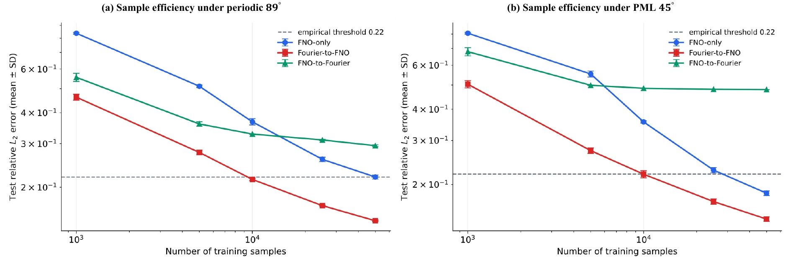
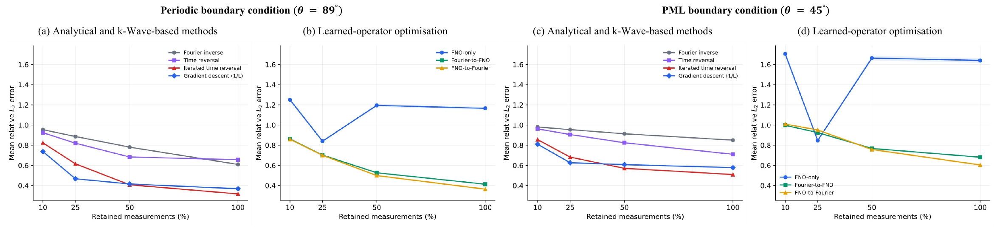

# Curated results

This directory contains a compact selection of the final artefacts reported in the dissertation. The selection supports the principal forward-accuracy, sample-efficiency, runtime, and reconstruction-robustness conclusions without duplicating the complete experiment outputs.

## Thesis correspondence

| Thesis item | Repository file | Content |
|---|---|---|
| Table 2 | `tables/table2_forward_accuracy.csv` | Held-out forward accuracy on the medium and large benchmarks |
| Table 3 | `tables/table3_sample_efficiency.csv` | Forward error across five training-set sizes and three seeds |
| Table 4 | `tables/table4_runtime.csv` | CPU and RTX 4090 runtime benchmark records |
| Table 8 | `tables/table8_reconstruction_robustness.csv` | Reconstruction metrics and bootstrap intervals across four retention levels |
| Figure 5 | `figures/figure5_sample_efficiency.png` | Sample-efficiency curves on the large benchmark |
| Figure 10 | `figures/figure10_reconstruction_retention.png` | Reconstruction error as a function of measurement retention |

Figures 1 and 2 are stored separately under `figures/method/` and are displayed in the main project README.

## Core result figures

### Sample efficiency

*Forward relative L2 error across five training-set sizes on the large benchmark. Markers show the mean over three independent seeds and error bars show one standard deviation.*

### Reconstruction robustness

*Mean reconstruction relative L2 error across 10%, 25%, 50%, and 100% measurement retention. Analytical and k-Wave-based methods are separated from learned-operator optimisation.*

PDF versions of both figures are included for lossless inspection and reuse.

## Data provenance

- `table2_forward_accuracy.csv` is derived from the final medium- and large-benchmark comparison records and contains 1,000- and 10,000-image test results, respectively.
- `table3_sample_efficiency.csv` is the final 30-row summary of three operators, five training-set sizes, two acquisition conditions, and three independent training seeds.
- `table4_runtime.csv` combines the reported CPU batch-one, RTX 4090 batch-one, and RTX 4090 batch-64 benchmark records. The contemporaneous CPU k-Wave measurements used as GPU speed-up references remain in the file.
- `table8_reconstruction_robustness.csv` contains all seven reconstruction methods, both acquisition conditions, four retention levels, 1,000 test images, and 2,000-resample bootstrap intervals.

The CSV files retain full-precision values. The dissertation tables round these values for presentation.

## Scope

Only small final summaries and selected figures are version controlled. The following artefacts are intentionally excluded because of their size:

- raw HDF5 datasets and shards;
- complete model-checkpoint collections;
- per-sample prediction arrays;
- complete reconstruction arrays;
- training and reconstruction logs;
- temporary analysis outputs.

The fixed example under `examples/` provides the small sample data, checkpoint, and expected metrics needed to run the assessor-facing reproducibility check. Full experiment outputs can be regenerated using the commands documented in the main project README.
